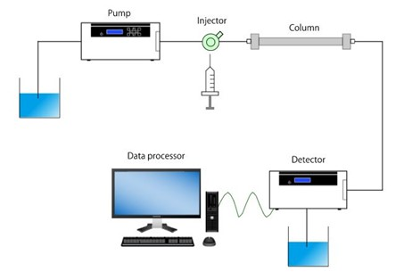

# High-Resolution Finite Volume for LKM

A MATLAB framework for the numerical simulation of nonlinear and non-equilibrium gradient elution chromatography using high-resolution finite volume methods (HR-FVM) and Lumped Kinetic Models (LKM).

---

## Overview

This repository provides a modular MATLAB framework for the numerical simulation of nonlinear and non-equilibrium gradient elution chromatography using Lumped Kinetic Models (LKM) and high-resolution finite volume methods (HR-FVM). The developed computational framework incorporates nonlinear Langmuir adsorption isotherms, Linear Solvent Strength (LSS) theory, axial dispersion, finite mass transfer kinetics, and gradient elution effects arising in chromatographic transport processes. The numerical implementation is based on Total Variation Diminishing (TVD) finite volume discretizations together with Koren flux limiter schemes for accurately capturing steep concentration fronts while reducing numerical diffusion and spurious oscillations. The repository supports both single- and multicomponent chromatography simulations, temporal moment analysis, and reproducible computational studies for chromatographic separation processes.

---

## Repository Structure

```text
High-Resolution-Finite-Volume-for-LKM/
│
├── README.md
├── LICENSE
├── CITATION.cff
│
├── matlab/
│   │
│   ├── run_gradient_elution_lkm.m
│   ├── gradient_elution_lkm_solver.m
│   │
│   ├── schemes/
│   │   ├── fv_koren_tvd.m
│   │   ├── fv_backward_difference.m
│   │   └── fv_leveque_tvd.m
│   │
│   ├── flux_limiters/
│   │   └── koren_flux_limiter.m
│   │
│   ├── models/
│   │   ├── langmuir_isotherm.m
│   │   └── lss_parameter_model.m
│   │
│   ├── analysis/
│   │   └── compute_temporal_moments.m
│   │
│   └── plotting/
│       ├── plot_single_component.m
│       ├── plot_two_component.m
│       └── plot_temporal_moments.m
│
├── figures/
│   └── chromatography_process.png
│
├── papers/
└── examples/
```

---

## General Chromatographic Process

The general liquid chromatography process consists of a mobile phase carrying injected solute species through a packed chromatographic column where separation occurs because of different adsorption and desorption dynamics between the mobile and stationary phases. The pump drives the solvent through the system, the injector introduces the sample mixture, and the detector records the elution profiles of separated components. The obtained chromatograms are then processed computationally for further analysis.

<p align="center">
  
</p>

The nonlinear Lumped Kinetic Model (LKM) implemented in this repository is designed to mathematically describe these transport and adsorption mechanisms under gradient elution operating conditions. The framework incorporates convection, axial dispersion, nonlinear adsorption equilibrium, and finite mass transfer kinetics using high-resolution finite volume discretizations.

---

## Mathematical Model

The governing nonlinear lumped kinetic model can be written as

$$
\frac{\partial c_i}{\partial t}
+
u \frac{\partial c_i}{\partial z}
=
D_{z,i}\frac{\partial^2 c_i}{\partial z^2}
-
F K_{L,i}(q_i^* - q_i)
$$

where $c_i$ denotes the concentration in the mobile phase, $q_i$ represents the concentration in the stationary phase, $u$ is the interstitial velocity, $D_{z,i}$ is the axial dispersion coefficient, and $K_{L,i}$ denotes the mass transfer coefficient.

The adsorption kinetics are modeled as

$$
\frac{\partial q_i}{\partial t}
=
K_{L,i}(q_i^* - q_i)
$$

where $q_i^*$ is the equilibrium adsorption concentration.

The nonlinear Langmuir equilibrium relation is given by

$$
q_i^* =
\frac{K_{H,i} c_i}
{1 + \sum_{j} b_j c_j}
$$

where $K_{H,i}$ denotes the Henry coefficient and $b_j$ represents the nonlinear adsorption parameters.

The framework further incorporates Linear Solvent Strength (LSS) theory for solvent-dependent transport and adsorption parameters under gradient elution operating conditions.

---

## Numerical Method

The numerical framework employs semi-discrete high-resolution finite volume methods for solving the nonlinear convection-diffusion-reaction systems arising from the chromatographic Lumped Kinetic Model. The governing partial differential equations are spatially discretized using conservative finite volume formulations combined with TVD flux-limiting strategies and Koren limiter reconstructions to accurately resolve sharp concentration gradients. Time integration is performed using MATLAB ODE solvers, particularly ODE45, resulting in a robust and reproducible computational framework suitable for nonlinear chromatographic transport simulations. The numerical approach is specifically designed to preserve stability, minimize numerical oscillations, and reduce excessive numerical diffusion in convection-dominated regimes.

---

## Example Applications

The computational framework can be used for a broad range of chromatographic separation studies, including single-component and multicomponent gradient elution chromatography, nonlinear adsorption analysis, temporal moment analysis, mass transfer investigations, and axial dispersion studies. The framework also supports simulations involving core-shell particle configurations and nonlinear transport behavior under varying operating conditions. Owing to its modular structure, the repository can further serve as a baseline platform for benchmarking numerical methods and developing advanced machine learning or operator-learning surrogate models for chromatographic systems.

---

## Running the Code

Run the main simulation script:

```matlab
run_gradient_elution_lkm
```

Example scripts are provided in:

```text
examples/
```

---

## Requirements

- MATLAB R2018a or newer
- MATLAB ODE Suite

---

## Citation

If you use this repository in your research, please cite the associated publications.

### Paper 1

```bibtex
@article{rehman2021numerical,
  title={Numerical approximation of nonlinear and non-equilibrium model of gradient elution chromatography},
  author={Rehman, Nazia and Abid, Muhammad and Qamar, Shamsul},
  journal={Journal of Liquid Chromatography \& Related Technologies},
  volume={44},
  number={7-8},
  pages={382--394},
  year={2021},
  publisher={Taylor \& Francis}
}
```

### Paper 2

```bibtex
@article{ahmad2022novel,
  title={A Novel Numerical Treatment of Nonlinear and Nonequilibrium Model of Gradient Elution Chromatography considering Core-Shell Particles in the Column},
  author={Ahmad, Abdulaziz Garba and Kaabar, Mohammed K. A. and Rashid, Saima and Abid, Muhammad},
  journal={Mathematical Problems in Engineering},
  volume={2022},
  pages={1--14},
  year={2022},
  publisher={Hindawi}
}
```

---

## License

This project is distributed under the MIT License.
